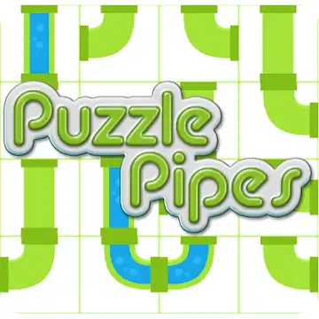
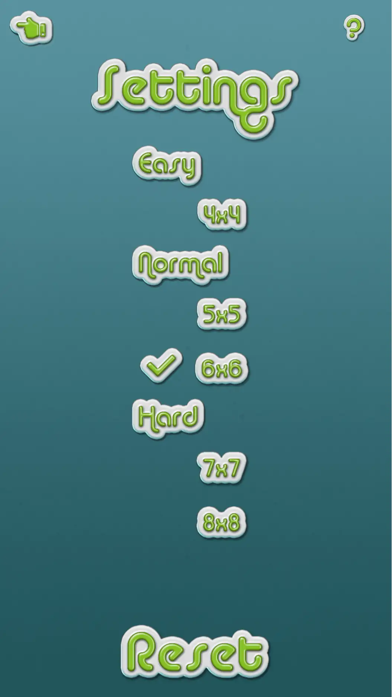
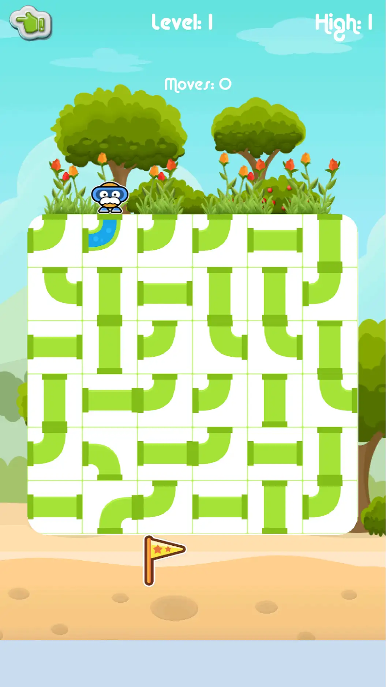
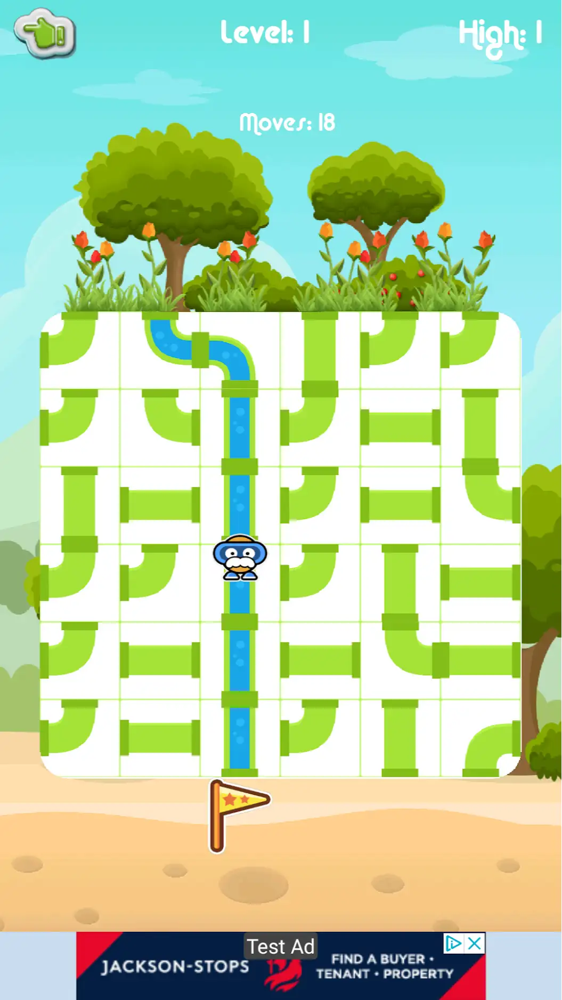

# Puzzle Pipes

Rearrange pipes to create a clear route to the flag - but make sure you don't accidentally fall down the drain!

 
 
 
 
 
 

# Screenshots

Puzzle Pipes is based on [PuzzleRoad](https://github.com/nmi/PuzzleRoad)
